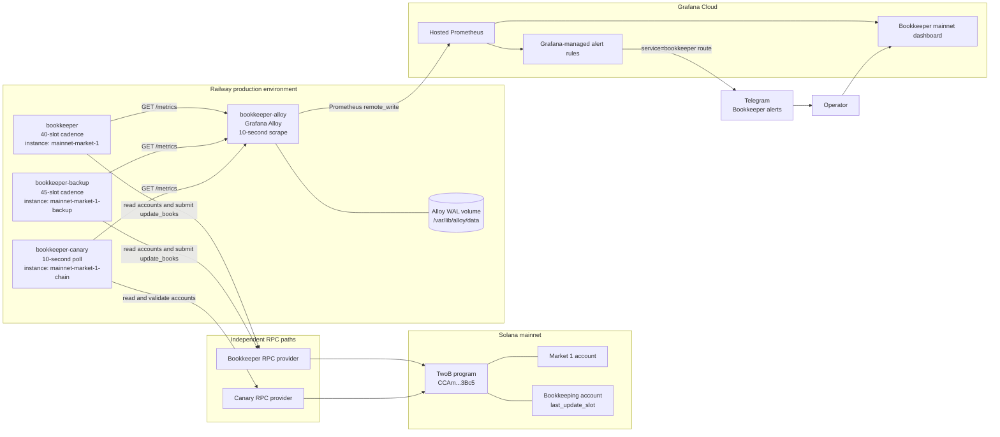
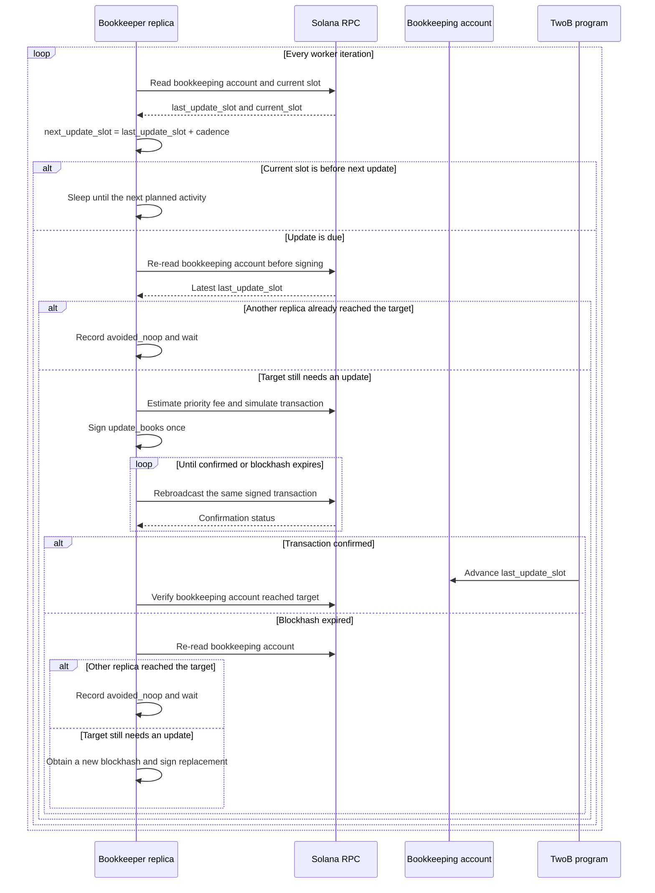
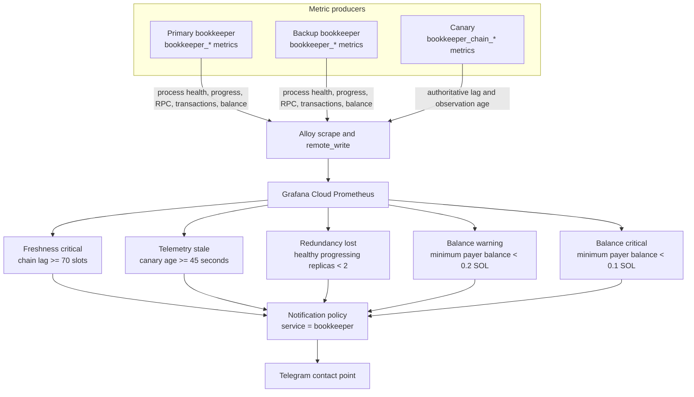

# Bookkeeping service architecture

This document is the canonical architecture description for the mainnet
bookkeeping service. Its Mermaid diagrams are the source of truth for the Miro
board used for presentation and collaborative annotation.

Presentation copy: [Mato Bookkeeping — Mainnet Architecture in Miro](https://miro.com/app/board/uXjVHrrvPU4=/)

## Scope

The production deployment maintains market `1` for program
`CCAmAqvza37EWzou7LoYCaGKzdJsCu1CLPMp3Wvx3Bc5` on Solana mainnet. It contains
two independent transaction-sending bookkeepers, a read-only chain canary, a
Grafana Alloy collector, and Grafana Cloud monitoring with Telegram
notifications.

## Deployment topology



## Responsibilities

| Component | Responsibility | Mutates chain state? | Failure coverage |
| --- | --- | --- | --- |
| `bookkeeper` | Normally reaches the update target first at a 40-slot cadence. | Yes | Primary transaction path |
| `bookkeeper-backup` | Independently attempts updates at a 45-slot cadence. | Yes | Continues when the primary is unavailable |
| `bookkeeper-canary` | Reads and validates the real market and bookkeeping accounts through an independent RPC path. | No | Detects actual on-chain staleness and monitoring uncertainty |
| `bookkeeper-alloy` | Scrapes all three `/metrics` endpoints over Railway private networking and remotely writes samples. | No | Buffers remote-write samples in its persistent WAL |
| Grafana Cloud | Stores metrics, renders the dashboard, evaluates alerts, and routes notifications. | No | Central monitoring and notification plane |
| Telegram | Delivers warning and critical notifications to the operations chat. | No | Human notification channel |

## Book update behavior

Each bookkeeper runs the same algorithm with a different configured cadence.
They do not elect a leader and do not share process state. Safety comes from
re-reading the on-chain bookkeeping account before signing and again after a
blockhash expires.



The primary cadence is 40 slots and the backup cadence is 45 slots. Both are
below the 49-slot informational warning boundary, so the primary normally
updates first while the backup remains close enough to take over without a
freshness incident.

## Monitoring and alert flow

Worker metrics describe what each process believes it is doing. Canary metrics
describe the independently observed chain state. Production freshness alerting
uses the canary, not either worker's local view.



### Freshness model

The canary derives the critical freshness boundary from the market account:

```text
freshness_boundary_slots = end_slot_interval * ARRAY_LENGTH = 70
informational_warning_slots = ceil(70 * 70%) = 49
critical_lag_slots = 70
```

The 49-slot threshold is a dashboard aid only. It does not create a freshness
notification. Grafana sends the freshness alert only when the independently
observed chain lag reaches 70 slots.

### Production alerts

| Rule | Signal | Condition | Severity |
| --- | --- | --- | --- |
| Bookkeeper freshness critical | `bookkeeper_chain_lag_slots` | At least the dynamic chain critical boundary, currently 70 slots | Critical |
| Bookkeeper telemetry stale | Canary observation timestamp | Observation age at least 45 seconds, no data, or query error | Critical |
| Bookkeeper redundancy lost | Worker scrape state and next expected activity | Fewer than two healthy, progressing replicas | Critical |
| Bookkeeper payer balance warning | Lowest worker payer balance | Below 0.2 SOL and at least 0.1 SOL | Warning |
| Bookkeeper payer balance critical | Lowest worker payer balance | Below 0.1 SOL | Critical |

All rules carry `service=bookkeeper`, `environment=mainnet`, and `market_id=1`.
The notification policy matches `service=bookkeeper` and sends the result to
Telegram.

## Private endpoints and state

| Service | Private endpoint | Persistent state |
| --- | --- | --- |
| `bookkeeper` | `bookkeeper.railway.internal:8080` | None; on-chain state is authoritative |
| `bookkeeper-backup` | `bookkeeper-backup.railway.internal:8080` | None; on-chain state is authoritative |
| `bookkeeper-canary` | `bookkeeper-canary.railway.internal:8080` | None |
| `bookkeeper-alloy` | Port `12345`; scrapes the three endpoints above | Remote-write WAL at `/var/lib/alloy/data` |

Each bookkeeper and the canary expose `/livez`, `/readyz`, and `/metrics`.
Alloy exposes `/-/healthy`, `/-/ready`, and its own `/metrics` endpoint.

## Failure interpretation

| Observation | Likely interpretation | First action |
| --- | --- | --- |
| One worker is unavailable, chain lag remains healthy | Redundancy is degraded but bookkeeping continues. | Repair only the failed replica. |
| Both workers are available, chain lag reaches 70 | Transactions are not advancing the on-chain account. | Check payer balances, RPC failures, simulations, priority fees, and transaction logs. |
| Canary samples are stale | The authoritative monitoring path is unavailable; chain freshness is unknown. | Check canary RPC and Alloy remote write, then inspect worker logs separately. |
| Worker metrics disappear but canary remains fresh | Collection or worker telemetry failed; chain state is still progressing. | Check Alloy targets and the affected Railway service. |
| Both worker balances are low | Future transactions may fail even if freshness is currently healthy. | Verify payer addresses and refill safely. |

Never restart or redeploy both transaction-sending replicas simultaneously.
Deploy and verify one replica before touching the other.

## Maintaining the diagrams

1. Update the Mermaid diagrams in this file in the same change as an
   architecture or deployment change.
2. Review the text diff in Git before merging.
3. After the change is deployed, update the corresponding Miro diagram from
   the Mermaid source.
4. Treat Miro as the presentation and discussion copy. If Miro and this file
   disagree, this file is authoritative.

Operational queries, exact PromQL, and incident procedures live in
[`monitoring/grafana/RUNBOOK.md`](../monitoring/grafana/RUNBOOK.md). Canary and
Alloy deployment details live in [`docs/bookkeeper-canary.md`](bookkeeper-canary.md)
and [`monitoring/alloy/README.md`](../monitoring/alloy/README.md).
