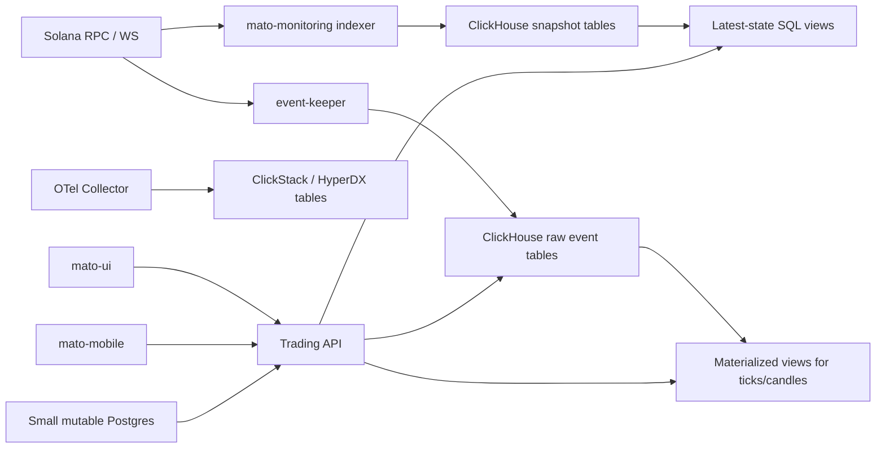

# ClickHouse Migration Plan

This document turns the current Supabase/Postgres usage into a concrete ClickHouse target design for:

- `twob-keepers`
- `mato-ui`
- `mato-mobile`
- `mato-monitoring`
- service telemetry such as logs, metrics, traces, health, and performance

It is based on the current code paths in:

- `/Users/thgehr/development/mato/twob-keepers/src/bin/event-keeper/main.rs`
- `/Users/thgehr/development/mato/twob-keepers/src/database.rs`
- `/Users/thgehr/development/mato/mato-ui/src/features/trading/api/market-repository.ts`
- `/Users/thgehr/development/mato/mato-mobile/src/hooks/useMarketUpdateRange.ts`
- `/Users/thgehr/development/mato/mato-mobile/src/hooks/useMarketPrice.ts`
- `/Users/thgehr/development/mato/mato-monitoring/sql/001_init.sql`

## 1. Current State

### Keeper writes

Today, `event-keeper`:

- connects directly to Supabase Postgres
- listens to Solana log subscriptions
- inserts:
  - `market_update_events`
  - `close_position_events`

The writer assumes Postgres-style idempotency with:

- `ON CONFLICT (signature) DO NOTHING`

### UI and mobile reads

Today, `mato-ui` and `mato-mobile` read Supabase tables directly:

- `market_configs`
- `market_update_events`
- `close_position_events`

The apps depend on a few query patterns:

- latest market update by `market_id`
- descending pages of recent updates
- ascending slot-range queries with one anchor event before `start_slot`
- closed positions filtered by `position_authority`
- direct realtime inserts via Supabase `postgres_changes`

### Monitoring writes

`mato-monitoring` currently mixes:

- mutable latest-state tables:
  - `markets`
  - `trade_positions`
  - `liquidity_positions`
- append-only history:
  - `market_snapshots`
  - `liquidity_position_snapshots`
  - `close_position_events`
  - `liquidity_liquidation_events`
- mutable dedupe state:
  - `processed_signatures`

## 2. Target Architecture

### Recommended split

Use ClickHouse for:

- append-only market events
- chart source data
- market and position snapshots
- liquidation and fee history
- internal analytics such as volume, performance, error events, latency, and health
- observability data via OpenTelemetry and HyperDX

Keep a small mutable store outside ClickHouse for:

- `processed_signatures`
- admin-edited `market_configs`
- auth, sessions, queues, locks, and operational job state

If you want to minimize technologies:

- keep a very small Postgres only for mutable state
- move everything analytical into ClickHouse

This keeps ClickHouse in the role it is best at and avoids forcing OLTP patterns into it.

### High-level data flow



## 3. Core Design Rules

### Rule 1: Store event time explicitly

Do not build charts from insert time.

Both `mato-ui` and `mato-mobile` currently derive candle time from `created_at`. In ClickHouse, write both:

- `event_time`
- `ingested_at`

Recommended semantics:

- `event_time`: Solana `block_time` when available
- fallback `event_time`: arrival time in the keeper
- `ingested_at`: when this row was inserted into ClickHouse

This gives stable chart buckets and still lets you debug ingestion lag.

### Rule 2: Add a stable event identity

Do not use bare `signature` as the unique identifier for all event types.

Use:

- `event_type`
- `signature`
- `event_index`

Where `event_index` is the ordinal position of the parsed event within a transaction.

This is important because one transaction can produce multiple parsed events.

### Rule 3: Denormalize chart-critical metadata into event rows

For market updates, include:

- `base_decimals`
- `quote_decimals`
- optionally `base_mint`, `quote_mint`, `base_ticker`, `quote_ticker`

This avoids joining a mutable config table during candle/materialized-view computation.

### Rule 4: Prefer append-only snapshots over mutable latest-state tables

For monitoring, the most ClickHouse-native model is:

- write snapshots append-only
- derive latest state with `argMax(...)` views

Instead of:

- `UPDATE markets SET ...`
- `UPSERT liquidity_positions ...`

## 4. Proposed ClickHouse Schema

## 4.1 Database

```sql
CREATE DATABASE IF NOT EXISTS mato;
```

## 4.2 Raw market update events

This is the main source for charts and live price.

```sql
CREATE TABLE IF NOT EXISTS mato.raw_market_update_events
(
    event_type LowCardinality(String) DEFAULT 'market_update',
    event_uid String,
    signature String,
    event_index UInt16,
    slot UInt64,
    market_id UInt64,

    base_flow UInt64,
    quote_flow UInt64,

    base_decimals UInt8,
    quote_decimals UInt8,
    base_mint String,
    quote_mint String,
    base_ticker LowCardinality(String),
    quote_ticker LowCardinality(String),

    block_time Nullable(DateTime64(3, 'UTC')),
    event_time DateTime64(3, 'UTC'),
    ingested_at DateTime64(3, 'UTC') DEFAULT now64(3),

    source LowCardinality(String) DEFAULT 'event-keeper'
)
ENGINE = MergeTree
PARTITION BY toYYYYMM(event_time)
ORDER BY (market_id, slot, event_index, event_uid);
```

`event_uid` should be generated by the writer, for example:

- `market_update:<signature>:<event_index>`

## 4.3 Raw close position events

```sql
CREATE TABLE IF NOT EXISTS mato.raw_close_position_events
(
    event_type LowCardinality(String) DEFAULT 'close_position',
    event_uid String,
    signature String,
    event_index UInt16,
    slot UInt64,

    market_id UInt64,
    market_address String,
    position_authority String,

    start_slot UInt64,
    end_slot UInt64,
    deposit_amount UInt64,
    swapped_amount UInt64,
    remaining_amount UInt64,
    fee_amount UInt64,
    is_buy Bool,

    instruction_name LowCardinality(String),

    block_time Nullable(DateTime64(3, 'UTC')),
    event_time DateTime64(3, 'UTC'),
    ingested_at DateTime64(3, 'UTC') DEFAULT now64(3),

    source LowCardinality(String) DEFAULT 'event-keeper'
)
ENGINE = MergeTree
PARTITION BY toYYYYMM(event_time)
ORDER BY (market_id, position_authority, end_slot, slot, event_index, event_uid);
```

## 4.4 Market update ticks

This derived table makes price queries and candle materialization much simpler.

```sql
CREATE TABLE IF NOT EXISTS mato.market_update_ticks
(
    event_uid String,
    market_id UInt64,
    slot UInt64,
    event_time DateTime64(3, 'UTC'),

    price Float64,
    quote_volume Float64,

    base_flow UInt64,
    quote_flow UInt64,
    base_decimals UInt8,
    quote_decimals UInt8
)
ENGINE = MergeTree
PARTITION BY toYYYYMM(event_time)
ORDER BY (market_id, event_time, slot, event_uid);
```

```sql
CREATE MATERIALIZED VIEW IF NOT EXISTS mato.mv_market_update_ticks
TO mato.market_update_ticks
AS
SELECT
    event_uid,
    market_id,
    slot,
    event_time,
    (toFloat64(quote_flow) / pow(10, quote_decimals))
      / nullIf(toFloat64(base_flow) / pow(10, base_decimals), 0) AS price,
    abs(toFloat64(quote_flow) / pow(10, quote_decimals)) AS quote_volume,
    base_flow,
    quote_flow,
    base_decimals,
    quote_decimals
FROM mato.raw_market_update_events
WHERE base_flow > 0;
```

## 4.5 Candle aggregates

Start with `1m`. Add `5m`, `15m`, `1h`, `4h`, `1d` only when needed.

```sql
CREATE TABLE IF NOT EXISTS mato.market_candles_1m
(
    market_id UInt64,
    bucket_start DateTime('UTC'),

    open_state AggregateFunction(argMin, Float64, DateTime64(3, 'UTC')),
    high_state AggregateFunction(max, Float64),
    low_state AggregateFunction(min, Float64),
    close_state AggregateFunction(argMax, Float64, DateTime64(3, 'UTC')),
    volume_state AggregateFunction(sum, Float64),
    first_slot_state AggregateFunction(min, UInt64),
    last_slot_state AggregateFunction(max, UInt64),
    updates_state AggregateFunction(count)
)
ENGINE = AggregatingMergeTree
PARTITION BY toYYYYMM(bucket_start)
ORDER BY (market_id, bucket_start);
```

```sql
CREATE MATERIALIZED VIEW IF NOT EXISTS mato.mv_market_candles_1m
TO mato.market_candles_1m
AS
SELECT
    market_id,
    toStartOfMinute(event_time) AS bucket_start,
    argMinState(price, event_time) AS open_state,
    maxState(price) AS high_state,
    minState(price) AS low_state,
    argMaxState(price, event_time) AS close_state,
    sumState(quote_volume) AS volume_state,
    minState(slot) AS first_slot_state,
    maxState(slot) AS last_slot_state,
    countState() AS updates_state
FROM mato.market_update_ticks
GROUP BY market_id, bucket_start;
```

Query shape:

```sql
SELECT
    market_id,
    bucket_start,
    argMinMerge(open_state) AS open,
    maxMerge(high_state) AS high,
    minMerge(low_state) AS low,
    argMaxMerge(close_state) AS close,
    sumMerge(volume_state) AS volume,
    minMerge(first_slot_state) AS start_slot,
    maxMerge(last_slot_state) AS end_slot,
    countMerge(updates_state) AS updates
FROM mato.market_candles_1m
WHERE market_id = {market_id:UInt64}
  AND bucket_start >= {from:DateTime}
  AND bucket_start < {to:DateTime}
GROUP BY market_id, bucket_start
ORDER BY bucket_start ASC;
```

## 4.6 Monitoring snapshots

These cover the analytical half of `mato-monitoring`.

### Market snapshots

```sql
CREATE TABLE IF NOT EXISTS mato.market_snapshots
(
    market_address String,
    market_id UInt64,
    observed_slot UInt64,
    observed_at DateTime64(3, 'UTC'),

    open_positions UInt64,
    trade_open_positions UInt64,
    liquidity_open_positions UInt64,
    unhealthy_liquidity_positions UInt64,

    accumulated_base_fees UInt128,
    accumulated_quote_fees UInt128,
    base_flow UInt128,
    quote_flow UInt128,
    base_vault_amount UInt128,
    quote_vault_amount UInt128,

    raw_json String
)
ENGINE = MergeTree
PARTITION BY toYYYYMM(observed_at)
ORDER BY (market_address, observed_slot);
```

### Liquidity position snapshots

```sql
CREATE TABLE IF NOT EXISTS mato.liquidity_position_snapshots
(
    position_address String,
    market_address String,
    authority String,
    observed_slot UInt64,
    observed_at DateTime64(3, 'UTC'),

    base_balance UInt128,
    quote_balance UInt128,
    base_flow UInt128,
    quote_flow UInt128,
    base_debt UInt128,
    quote_debt UInt128,

    healthy Bool,
    health_reasons Array(String),
    raw_json String
)
ENGINE = MergeTree
PARTITION BY toYYYYMM(observed_at)
ORDER BY (position_address, observed_slot);
```

### Liquidation events

```sql
CREATE TABLE IF NOT EXISTS mato.raw_liquidity_liquidation_events
(
    event_uid String,
    signature String,
    instruction_index UInt16,
    instruction_name LowCardinality(String),

    market_address String,
    liquidity_position_address String,
    signer String,
    position_authority String,

    reward_base_amount UInt128,
    reward_quote_amount UInt128,
    debt_repaid_base_amount UInt128,
    debt_repaid_quote_amount UInt128,

    slot UInt64,
    block_time Nullable(DateTime64(3, 'UTC')),
    event_time DateTime64(3, 'UTC'),
    ingested_at DateTime64(3, 'UTC') DEFAULT now64(3)
)
ENGINE = MergeTree
PARTITION BY toYYYYMM(event_time)
ORDER BY (market_address, slot, instruction_index, event_uid);
```

## 4.7 Latest-state views for monitoring

These let you avoid mutable latest tables if you want to go all-in on ClickHouse for monitoring.

### Latest market state

```sql
CREATE VIEW IF NOT EXISTS mato.market_latest AS
SELECT
    market_address,
    argMax(market_id, observed_at) AS market_id,
    max(observed_slot) AS last_observed_slot,
    argMax(open_positions, observed_at) AS open_positions,
    argMax(trade_open_positions, observed_at) AS trade_open_positions,
    argMax(liquidity_open_positions, observed_at) AS liquidity_open_positions,
    argMax(unhealthy_liquidity_positions, observed_at) AS unhealthy_liquidity_positions,
    argMax(accumulated_base_fees, observed_at) AS accumulated_base_fees,
    argMax(accumulated_quote_fees, observed_at) AS accumulated_quote_fees,
    argMax(base_flow, observed_at) AS base_flow,
    argMax(quote_flow, observed_at) AS quote_flow,
    argMax(base_vault_amount, observed_at) AS base_vault_amount,
    argMax(quote_vault_amount, observed_at) AS quote_vault_amount,
    max(observed_at) AS observed_at
FROM mato.market_snapshots
GROUP BY market_address;
```

### Latest liquidity position state

```sql
CREATE VIEW IF NOT EXISTS mato.liquidity_position_latest AS
SELECT
    position_address,
    argMax(market_address, observed_at) AS market_address,
    argMax(authority, observed_at) AS authority,
    max(observed_slot) AS last_observed_slot,
    argMax(base_balance, observed_at) AS base_balance,
    argMax(quote_balance, observed_at) AS quote_balance,
    argMax(base_flow, observed_at) AS base_flow,
    argMax(quote_flow, observed_at) AS quote_flow,
    argMax(base_debt, observed_at) AS base_debt,
    argMax(quote_debt, observed_at) AS quote_debt,
    argMax(healthy, observed_at) AS healthy,
    argMax(health_reasons, observed_at) AS health_reasons,
    max(observed_at) AS observed_at
FROM mato.liquidity_position_snapshots
GROUP BY position_address;
```

## 5. What Stays Out of ClickHouse

These are the parts I would not force into ClickHouse:

### `processed_signatures`

This is mutable, point-lookup dedupe state. It is a better fit for:

- small Postgres
- Redis
- or another key-value store

### `market_configs`

If this is edited by humans or an admin UI, keep it in a small mutable store.

If you really want it in ClickHouse, model it as versioned rows and query latest with `argMax`, but that is more awkward for admin workflows.

### Auth and app control-plane data

Keep out of ClickHouse:

- users
- sessions
- auth tokens
- role bindings
- RLS-style policy data
- job leases and locks

## 6. API Contract For `mato-ui` And `mato-mobile`

The easiest migration is not to let the frontend query ClickHouse directly.

Create a backend service, referred to below as `trading-api`, that:

- queries ClickHouse
- reads small mutable config from Postgres if needed
- returns JSON that matches the current Supabase row shape as closely as possible

### Serialization rule

Return all large integer atom amounts as strings.

That preserves the current frontend parsing behavior and avoids JSON precision loss.

## 6.1 Market config

Maps to current `fetchMarketConfig(...)`.

### Request

`GET /v1/markets/:marketId/config`

### Response

```json
{
  "market_id": 1,
  "base_ticker": "SOL",
  "quote_ticker": "USDC",
  "base_mint": "So11111111111111111111111111111111111111112",
  "quote_mint": "EPjFWdd5AufqSSqeM2qN1xzybapC8G4wEGGkZwyTDt1v",
  "base_decimals": 9,
  "quote_decimals": 6,
  "updated_at": "2026-04-17T12:00:00.000Z"
}
```

## 6.2 Latest market price

Maps to `useMarketPrice(...)`.

### Request

`GET /v1/markets/:marketId/price`

### Response

```json
{
  "market_id": 1,
  "slot": 392001234,
  "price": 143.12,
  "base_flow": "5000000000",
  "quote_flow": "715600000",
  "event_time": "2026-04-17T12:01:02.345Z"
}
```

### Query source

- latest row from `mato.market_update_ticks`

## 6.3 Recent market updates page

Maps to `fetchMarketUpdatesPage(...)`.

### Request

`GET /v1/markets/:marketId/updates?limit=100&before_slot=392001234`

### Response

```json
{
  "items": [
    {
      "id": "market_update:5N...abc:0",
      "signature": "5N...abc",
      "slot": 392001233,
      "market_id": 1,
      "base_flow": "5000000000",
      "quote_flow": "715600000",
      "created_at": "2026-04-17T12:01:01.000Z"
    }
  ],
  "next_before_slot": 392001233
}
```

Notes:

- Keep `created_at` in the JSON if you want to minimize frontend diffs.
- Back it with `event_time` or `ingested_at`, but make that choice explicit and consistent.

## 6.4 Slot range with anchor event

Maps to the current `fetchMarketUpdateRange(...)` behavior.

### Request

`GET /v1/markets/:marketId/updates/range?start_slot=391000000&end_slot=392000000`

### Response

```json
{
  "anchor": {
    "id": "market_update:4A...zzz:0",
    "signature": "4A...zzz",
    "slot": 390999999,
    "market_id": 1,
    "base_flow": "4800000000",
    "quote_flow": "702000000",
    "created_at": "2026-04-17T11:00:00.000Z"
  },
  "updates": [
    {
      "id": "market_update:5N...abc:0",
      "signature": "5N...abc",
      "slot": 391000001,
      "market_id": 1,
      "base_flow": "5000000000",
      "quote_flow": "715600000",
      "created_at": "2026-04-17T12:01:01.000Z"
    }
  ]
}
```

This endpoint intentionally matches the current UI/mobile logic:

- one event before the range
- ascending events inside the range

## 6.5 Candles

This is the endpoint that should eventually replace client-side aggregation.

### Request

`GET /v1/markets/:marketId/candles?interval=1m&from=2026-04-17T10:00:00Z&to=2026-04-17T12:00:00Z`

### Response

```json
{
  "interval": "1m",
  "items": [
    {
      "time": 1776420000,
      "start_slot": 391000001,
      "end_slot": 391000120,
      "open": 142.95,
      "high": 143.30,
      "low": 142.81,
      "close": 143.12,
      "volume": 18234.22
    }
  ]
}
```

This response fits both:

- `mato-ui` trading candles
- `mato-mobile` TradingView-style candles

## 6.6 Closed positions

Maps to `fetchClosedPositionEvents(...)` and related calls.

### Request

`GET /v1/positions/closed?authority=<pubkey>&market_id=1&limit=50`

### Response

```json
{
  "items": [
    {
      "id": "close_position:3B...def:0",
      "signature": "3B...def",
      "slot": 392000500,
      "position_authority": "F8...xyz",
      "market_id": 1,
      "start_slot": 391900000,
      "end_slot": 392000400,
      "deposit_amount": "1000000000",
      "swapped_amount": "512000000",
      "remaining_amount": "488000000",
      "fee_amount": "1200000",
      "is_buy": 1,
      "created_at": "2026-04-17T12:03:00.000Z"
    }
  ]
}
```

## 6.7 Live updates

Do not make this the first migration milestone.

The lowest-risk cutover is:

- use plain HTTP for reads
- keep polling every 5 seconds for price
- add push later

### Phase 1 choice

- no realtime endpoint
- use `GET /v1/markets/:marketId/price` with polling

### Phase 2 choice

Add either:

- `GET /v1/markets/:marketId/stream` as Server-Sent Events
- or a WebSocket endpoint such as `/v1/ws`

Example event payload:

```json
{
  "type": "market_update",
  "market_id": 1,
  "slot": 392001240,
  "price": 143.19,
  "base_flow": "5001000000",
  "quote_flow": "716200000",
  "event_time": "2026-04-17T12:01:08.100Z"
}
```

## 7. Frontend Mapping

## 7.1 `mato-ui`

Current repository functions can be remapped almost directly:

- `fetchMarketConfig(...)`
  - from Supabase table read
  - to `GET /v1/markets/:marketId/config`
- `fetchLatestMarketUpdate(...)`
  - to `GET /v1/markets/:marketId/price` or `GET /v1/markets/:marketId/updates?limit=1`
- `fetchMarketUpdatesPage(...)`
  - to `GET /v1/markets/:marketId/updates`
- `fetchMarketUpdateRange(...)`
  - to `GET /v1/markets/:marketId/updates/range`
- `fetchClosedPositionEvents(...)`
  - to `GET /v1/positions/closed`
- `subscribeToMarketUpdates(...)`
  - temporarily remove
  - later replace with SSE or WebSocket

## 7.2 `mato-mobile`

Current mobile hooks can migrate in two passes:

### Pass 1

- `useMarketConfig`
  - call `/v1/markets/:marketId/config`
- `useMarketPrice`
  - call `/v1/markets/:marketId/price`
  - keep `refetchInterval: 5000`
  - remove Supabase realtime
- `useMarketUpdateRange`
  - call `/v1/markets/:marketId/updates/range`

This gets you off Supabase fast with very little product risk.

### Pass 2

- replace raw range reads with `/candles`
- add optional streaming updates

## 8. Writer Changes Needed In `twob-keepers`

## 8.1 Introduce a sink abstraction

Replace the current single Postgres `Database` writer with something like:

- `EventSink`
- `PostgresSink`
- `ClickHouseSink`
- `FanoutSink`

That allows:

- dual-write during migration
- easy verification
- clean rollback

## 8.2 Emit `event_index`

When parsing logs, keep track of the ordinal position of each parsed event inside the transaction.

That lets the writer produce:

- `event_uid`
- deterministic idempotency keys

## 8.3 Batch ClickHouse writes

Do not insert one row per request if you can avoid it.

Prefer:

- small in-memory batches
- periodic flush
- flush on shutdown

This matches ClickHouse ingestion better than row-at-a-time inserts.

## 8.4 Enrich events before insert

At write time, attach market metadata to `market_update_events`:

- decimals
- mint addresses
- tickers if available

This makes downstream chart queries much simpler and removes config joins from hot paths.

## 9. Migration Sequence

## Phase 0: Preparation

- provision ClickHouse
- provision ClickStack / HyperDX for observability
- keep current Supabase and monitoring Postgres untouched

## Phase 1: Raw event ingestion

- add ClickHouse tables for:
  - `raw_market_update_events`
  - `raw_close_position_events`
- add ClickHouse writer to `event-keeper`
- dual-write to Supabase and ClickHouse
- compare:
  - row counts
  - latest slot per market
  - latest price per market

Exit criteria:

- ClickHouse and Supabase agree on recent event streams

## Phase 2: Trading API

- build a small backend service that reads ClickHouse
- implement endpoints:
  - `/config`
  - `/price`
  - `/updates`
  - `/updates/range`
  - `/positions/closed`

Exit criteria:

- UI/mobile can read through the backend with no product regression

## Phase 3: Web cutover

- switch `mato-ui` repository functions to HTTP endpoints
- remove direct Supabase reads
- keep polling for live price

Exit criteria:

- web trading dashboard works without Supabase

## Phase 4: Mobile cutover

- switch `mato-mobile` hooks to HTTP endpoints
- remove Supabase realtime dependency
- keep 5-second polling initially

Exit criteria:

- mobile charts and latest price work without Supabase

## Phase 5: Candle acceleration

- enable `market_update_ticks`
- enable `1m` candle materialized view
- add `/candles` endpoint
- switch chart consumers from raw events to candles

Exit criteria:

- chart loading is faster
- less client-side work
- fewer large range scans

## Phase 6: Monitoring migration

Choose one of two paths:

### Option A: full ClickHouse analytics path

- replace mutable latest tables with append-only snapshots
- use `argMax` views for latest state
- move Grafana to ClickHouse datasource or use HyperDX plus SQL views

### Option B: hybrid path

- keep current monitoring Postgres for mutable latest state
- move history and dashboards to ClickHouse gradually

My recommendation:

- start with Option B
- move to Option A only if you actively want one analytical store

## Phase 7: Retire Supabase from trading data

- stop writes to Supabase event tables
- remove Supabase client usage in web/mobile
- keep Supabase only if you still need it for unrelated auth or storage

## 10. HyperDX Fit

HyperDX is a strong fit for:

- service logs
- request traces
- app metrics
- RPC latency
- keeper failures
- ingestion lag
- internal operational event exploration

HyperDX is not the right primary surface for:

- wallet-facing trading UI
- mobile price chart UX
- admin CRUD for configs
- transactional app flows

Best use:

- HyperDX for internal observability and incident response
- your own trading API plus product UI for charting and market screens

## 11. First Concrete Build Order

If starting tomorrow, I would build in this order:

1. Add `event_uid` and `event_index` to keeper event output.
2. Add ClickHouse raw tables.
3. Dual-write `event-keeper` to Supabase and ClickHouse.
4. Add `market_candles_1m` rollup + materialized view.
5. Build `GET /v1/markets/:marketId/price`.
6. Build `GET /v1/markets/:marketId/candles`.
7. Switch `mato-ui` chart reads to candle endpoint.
8. Switch `mato-mobile` chart reads to candle endpoint.
9. Add optional `/updates/range` only where still needed.
10. Move monitoring snapshots next.

This is the shortest path that reduces risk while still moving the important data to ClickHouse quickly.

## 12. Keeper dual-write env setup

The current `event-keeper` implementation supports optional dual-write:

- Postgres sink is enabled when `DATABASE_URL` is set.
- ClickHouse sink is enabled when `CLICKHOUSE_URL` is set.
- You can run with only one sink or with both.

### Required for ClickHouse sink

- `CLICKHOUSE_URL`

### Optional for Postgres sink

- `DATABASE_URL`

### Optional for ClickHouse sink

- `CLICKHOUSE_DATABASE` (default: `mato`)
- `CLICKHOUSE_USER` (default: `default`)
- `CLICKHOUSE_PASSWORD` (default: empty)
- `CLICKHOUSE_MARKET_UPDATES_TABLE` (default: `raw_market_update_events`)
- `CLICKHOUSE_CLOSE_POSITIONS_TABLE` (default: `raw_close_position_events`)
- `CLICKHOUSE_CHANNEL_CAPACITY` (default: `20000`)
- `CLICKHOUSE_BATCH_SIZE` (default: `1000`)
- `CLICKHOUSE_FLUSH_INTERVAL_MS` (default: `1000`)

Use the table bootstrap script in:

- `/Users/thgehr/development/mato/twob-keepers/docs/clickhouse-events-schema.sql`
- `/Users/thgehr/development/mato/twob-keepers/docs/clickhouse-candles-schema.sql`
- `/Users/thgehr/development/mato/twob-keepers/docs/clickhouse-candles-backfill.sql` (one-time)

After creating the candle materialized view, run the one-time backfill script
`clickhouse-candles-backfill.sql` so existing raw events are visible in candle queries.

## 14. Read API (implemented)

The repository now includes a `read-api` binary:

- `/Users/thgehr/development/mato/twob-keepers/src/bin/read-api/main.rs`

### Endpoints

- `GET /healthz`
- `GET /v1/markets/:marketId/price`
- `GET /v1/markets/:marketId/stream` (Server-Sent Events, `event: price_update`)
- `GET /v1/markets/:marketId/candles?from=2026-04-22T00:00:00Z&to=2026-04-22T12:00:00Z&interval=5m&max_points=1500`

### Why this avoids the old slowdown

- chart queries no longer page raw events in client code
- server enforces `max_points` and validates interval windows
- long-range candles are aggregated from `market_candles_1m` rollups, not from full raw event scans
- decimals are resolved server-side from `market_configs` (no frontend query params)
- live price updates are pushed over SSE so clients do not need to poll `/price`

### Read API env vars

- `READ_API_BIND_ADDR` (default: `0.0.0.0:8080`)
- `READ_API_CONFIG_DATABASE_URL` (optional override; falls back to `DATABASE_URL`)
- `READ_API_MARKET_CONFIG_CACHE_TTL_SECS` (default: `300`)
- `READ_API_PRICE_STREAM_POLL_MS` (default: `1000`; backend polling interval per active market stream)
- `CLICKHOUSE_URL` (required)
- `CLICKHOUSE_DATABASE` (default: `mato`)
- `CLICKHOUSE_USER` (default: `default`)
- `CLICKHOUSE_PASSWORD` (default: empty)
- `CLICKHOUSE_MARKET_UPDATES_TABLE` (default: `raw_market_update_events`)
- `CLICKHOUSE_CANDLES_1M_TABLE` (default: `market_candles_1m`)

## 13. Sink observability

The keeper heartbeat now prints `SinkHealth` lines per sink every minute.

For each sink, counters include:

- `market_ok` / `market_err`
- `close_ok` / `close_err`
- `last_error`

For ClickHouse sink, it also includes:

- `queued` (channel depth approximation)
- `buffered_market` / `buffered_close` (in-memory batch sizes)
- `flushed_market` / `flushed_close` (rows flushed)
- `flush_err` (flush failures)
- `last_flush_ms` (last flush latency)
